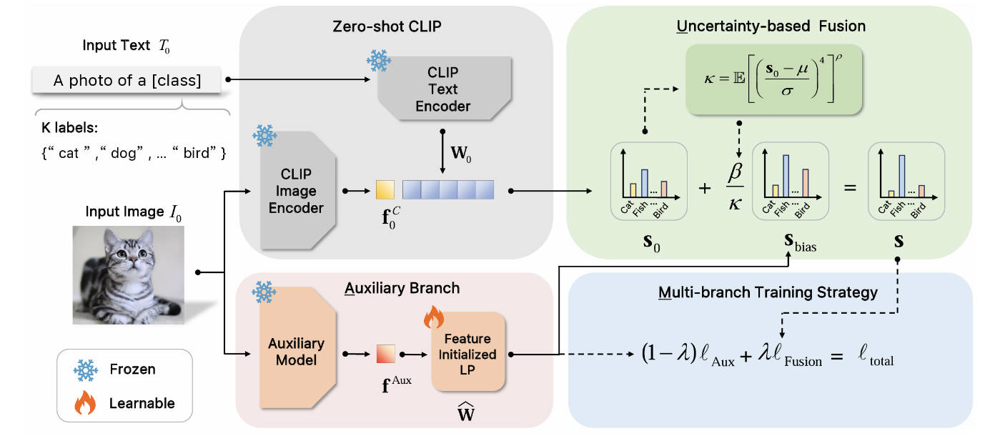

# 环境配置

本项目所用到的packages如下，并且请确保有GPU：

```
ftfy==6.2.3
gdown==5.2.0
jittor==1.3.8.5
numpy==2.1.0
opencv_contrib_python==4.10.0.84
opencv_python==4.10.0.84
opencv_python_headless==4.10.0.84
Pillow==9.4.0
Pillow==10.4.0
psutil==5.9.5
PyYAML==6.0.2
PyYAML==6.0.2
regex==2024.5.15
tqdm==4.66.5
```

## 开始本项目

首先利用anaconda创建一个python>=3.8的基础环境，之后下载相关依赖：

```shell
pip install -r requirements.txt
```

之后可以使用如下语句测试环境中的jittor是否安装成功：

```shell
python -m jittor.test.test_core
python -m jittor.test.test_example
python -m jittor.test.test_cudnn_op
```

### colab

另外，您也可以通过colab直接一站式运行，具体步骤：

* 将本项目中的jittorB.ipynb上传到colab中

* 将项目代码上传到谷歌云盘中
* 替换jittorB.ipynb中的路径
* 运行tran.py以及test.py进行训练和测试，之后模型会自动保存到您的谷歌云盘中

# 所用方法

项目的idea来自于 [**AMU-Tuning: Effective Logit Bias for CLIP-based Few-shot Learning**](https://arxiv.org/pdf/2404.08958.pdf)这篇论文。


<div align="center">
  
</div>

通过利用适当的辅助特征来预测逻辑偏差，这些辅助特征被输入到具有多分支训练的高效特征初始化线性分类器中。最后，基于不确定性的融合，将逻辑偏差纳入 CLIP 进行少样本分类。


# 使用的预训练模型

项目中除了使用比赛所提供的jittor版本的[clip](https://github.com/uyzhang/JCLIP/releases/tag/%E6%9D%83%E9%87%8D)模型之外，还使用了moco v3的预训练模型[mocov3_resnet50_8xb512-amp-coslr-800e_in1k](https://download.openmmlab.com/mmselfsup/1.x/mocov3/mocov3_resnet50_8xb512-amp-coslr-800e_in1k/mocov3_resnet50_8xb512-amp-coslr-800e_in1k_20220927-e043f51a.pth)，在下载之后将pytorch的模型权重转化为了jittor的模型权重。


# 最终参数数量之和


利用如下代码对最终模型的参数量进行打印：

```python
total_params = sum(p.numel() for p in model.parameters())
print(f"模型的总参数量: {total_params/(1024*1024)}M")
```

得到的结果：

```
模型的总参数量: 167.79069232940674M
```


# 开源链接

热身赛链接：https://www.gitlink.org.cn/shixuanw/jittor_Conditional-GAN

赛题1链接：
